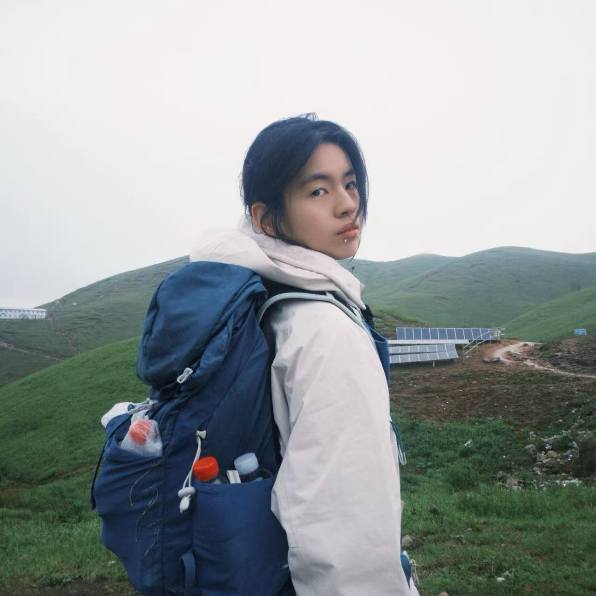
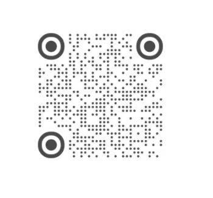
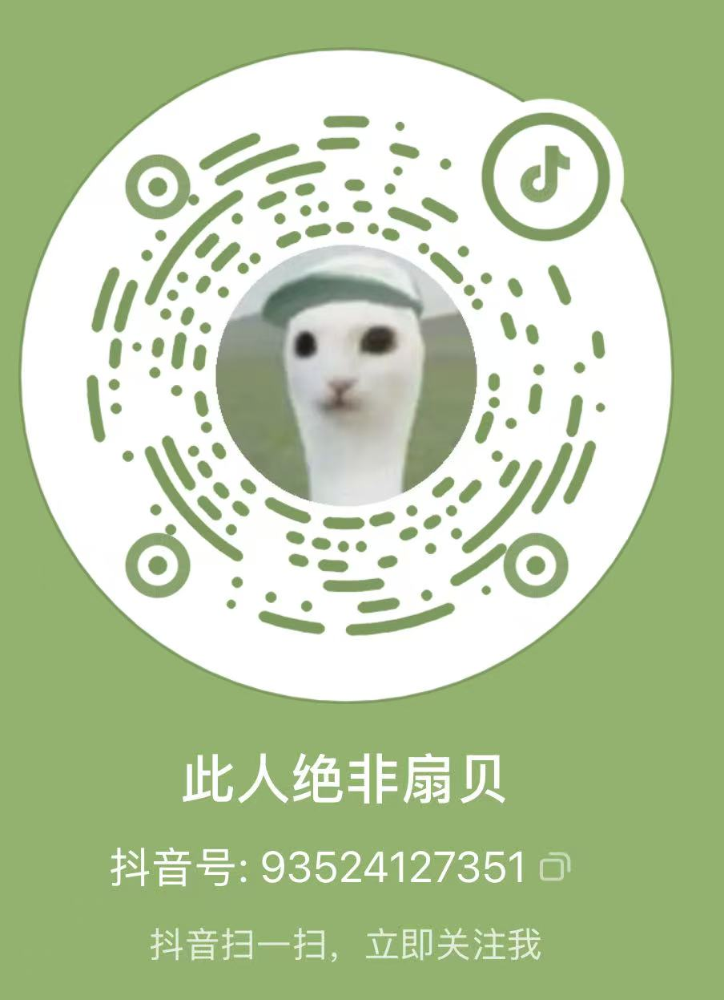

# 图片上传指南

请将你的图片放在对应的目录下：

## 首页个人照片
- `hero-photo.jpg` — 你的个人照片（建议正方形，比如 800x800）

## 项目截图 (`projects/` 目录下)

### 小红书
- `xhs-w1.jpg` ~ `xhs-w4.jpg` — 万赞系列 4 张
- `xhs-k1.jpg` ~ `xhs-k8.jpg` — 千赞爆文 8 张

### 抖音
- `douyin1.jpg` ~ `douyin3.jpg` — 抖音带货截图![alt text]

### IP 孵化
- `ip1.jpg` ~ `ip3.jpg` — IP 孵化运营截图

## 优势展示 (`advantages/` 目录下)
- `adv1-1.jpg` ~ `adv1-3.jpg` — 抗压能力
- `adv2-1.jpg` ~ `adv2-3.jpg` — 执行力
- `adv3-1.jpg` ~ `adv3-3.jpg` — 学习成长

## 二维码（放在 `images/` 根目录）
- `qr-xiaohongshu.png` — 小红书二维码
- `qr-douyin.png` — 抖音二维码
